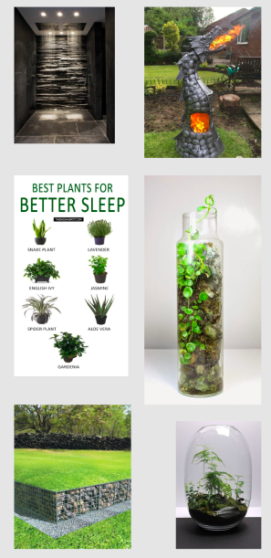
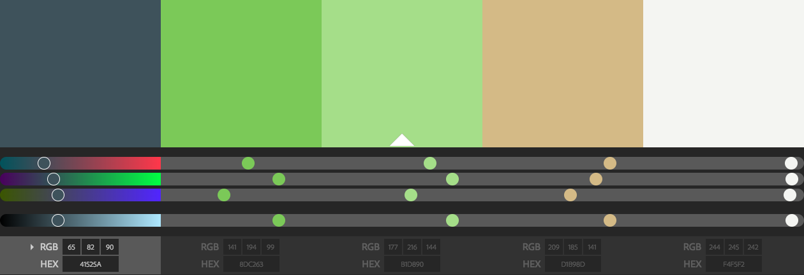
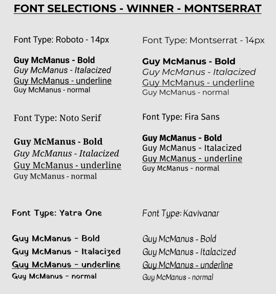
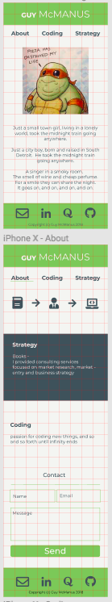
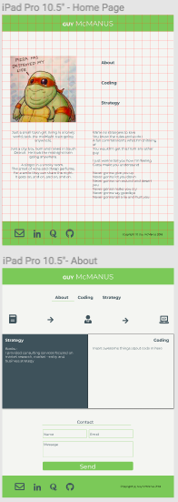
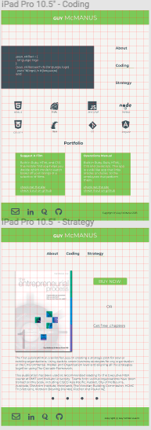
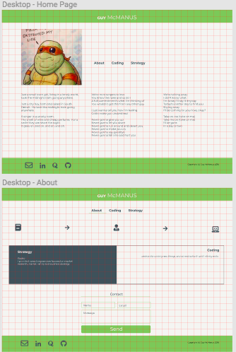
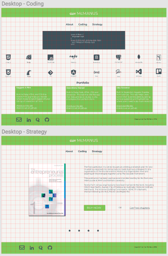

# Portfolio Project
This portfolio project can be viewed at http://guymcmanusgithub.github.io

The github repository for this project can be viewed at: https://github.com/guymcmanusgithub/guymcmanusgithub.github.io

--- 

## Description
---
### Purpose
The purpose of this portfolio project is to create a personal website that reflects who I am and showcases my achievements, projects, products and personality.

### Functionality / Features

### Sitemap
This website is comprised of 6 pages:
* Home
* About
* Coding
* Business
* Projects
* Books

### Target Audience
The target audience for this site is potential employers or clients.

### Tech Stack
The following tech stack was used to create this portfolio website:

* HTML 5
* CSS 3
* Github
* Github pages
* Git
* Formspree
* Photoshop CC

#### Honorable mentions
These tools / sites / services were also used in the creation of various attributes of the website: 

* Font Awesome.  For SVG files.
* Devicon. For other SVG files.
* Google Fonts. To include different fonts in this website (Montserrat and Inconsolata)
* Youtube. Channels: Online Tutorials / DarkCode / Codegrid / Coding Tech 
* Pinterest. To create a mood board.
* Adobe color circle. To help draw out colors from selected images.
* Figma. To create wireframes
* Trello.  For project management
--- 
## Design and Documentation
---
### Design Process

### Wireframes

### Usability considerations
Several techniques were utilised to aid in accessibility and usability, these included: 
* Alt-tags for images and svg's
* Re-styling my navigation bar to show where a user currently is, as well as highlighting where their mouse is currently hovering.
* Avoiding the use of #000 and #fff to soften the experience of visiting my site on the eyes.  Bright colors were also not used for the same reason.
* Pointer effects on the contact me form, to aid the user in knowing what field they are currently in.
* The site has been designed to be fully responsive so that the user has a pleasant experience on the site regardless of the device they are using to view it.

---
## Details of Planning process
---
### Project Plan and timeline

### Trello boards
The trello boards can be viewed here: https://trello.com/b/LmbzWcnn/portfolio-project

#### Screenshots of Trello Boards

---
## Short Answer Q & A
### Describe key events in the development of the Internet from the 1980s to today

Tim Berners Lee did a bunch of stuff that culminated in the HTML syntax.

### Define and describe the relationship between fundamental aspects of the internet such as: domains, web servers, DNS, and web browsers.

domains: every website (or device with an independent connection to the internet) has an IP address.  This is a series of 4 numbers separated by dots - i.e. 111.12.4.213.  A domain name are the words that are connected to that number, i.e. 'www.google.com.  Domains are made up of two different different levels, top level and second level.  top level relates to the last part of the domain name - i.e. .com or .org.au and so on.  the second level appears before the .com and it is the name of your site, i.e. 'google'.  The domain is the address to your website, the website name is the name of that address.

web servers: a web server is software that allows you to transfer files (like web pages) between two comptuers using a web browser.

DNS: is an acronym for Domain Name Server. It uses the Domain Name System to connect a domain name (www.google.com) to an IP address (111.111.111.111) 

Web browsers: a web browser is an application that allows users to view and access web sites.  it translates (or renders) HTML into a symantic structure and then styles that structure utilising CSS.  Additional functionality can be added through other programming languages like Ruby and Javascript and their libraries.

### Reflect on one aspect of the development of internet technolgoies and how it has contributed to the world today.
