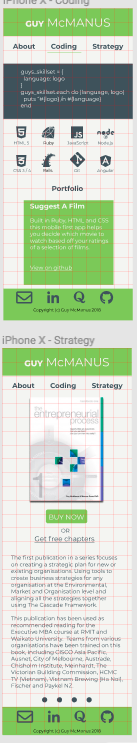

# Portfolio Project
This portfolio project can be viewed at http://guymcmanusgithub.github.io

The github repository for this project can be viewed at: https://github.com/guymcmanusgithub/guymcmanusgithub.github.io

--- 

## Description
---
### Purpose
The purpose of this portfolio project is to create a personal website that reflects who I am and showcases my achievements, projects, products and personality.


### Functionality / Features

Each page on this website has a different feature which sets it apart from the other pages:
<br>
<br>
#### Nav Bar and Footer
The Nav bar's design changed from the initial design in figma to a more user-friendly design.  The Nav bar now highlights the page that someone is on, and the selection that the mouse is hovering on if the user is on a desktop.

The Nav bar is also responsive so it displays on any device size, without the use of a hamburger menu.

The footer provides links to my main social accounts and a jump link to the contact form on the About page when the envelope icon is clicked.

<br>
<br>
#### Home Page<br>
The Home page features cards which 'pop' and reveal a button when you hover on them using a mouse, or click on them using a tablet or phone.


To make the cards 'pop' off the screen I utilised the following code in CSS:

```
.home-container .box:hover {
    transform: scale(1.1);
    z-index: 1;
    box-shadow: 0 5px 20px rgba(0,0,0,1);
}
```

<br>
<br>

#### About Page
The About Page includes a contact me form that changes the color of the field name to green and the size of the name of the field to 12px, when the field is selected.

The following code was used to achieve this result:

```
.about-container .contact-me input:focus ~ label,
.about-container .contact-me textarea:focus ~ label,
.about-container .contact-me input:valid ~ label,
.about-container .contact-me textarea:valid ~ label {
    top: 12px;
    left: 0;
    color: #8dc263;
    font-weight: bold;
}

```

<br>
<br>

#### Coding Page
The Coding Page has a feature whereupon the users arrival some ruby code appears as if it is being typed out:


The timing behind the text type out was achieved by defining the number of seconds after the page loads as to when each element should begin.  The elements were selected using the n-th-child selector.  To make the typing faster or slower, alter the number argument in the 'steps' method - currently set at 60.  Here is a code snippet of some of that in action:

```
.typewriter-text pre:nth-child(2) {
    animation: typing-2 2.5s steps(60, end);
}
.typewriter-text pre:nth-child(3) {
    animation: typing-2 4s steps(60, end);
}
```

The typewriter text and blinking cursor feature on this page was achieved utilising @keyframes and a few of their methods:
```
@keyframes typing {
    from {width: 0;}
}
@keyframes typing-2 {
  0% {width: 0;}
  50% {width: 0;}
  100% {width: 100;}
}
@keyframes blink {
    to {opacity: .0;}
}
.cursor {
    animation: blink 1s infinite;
}
```

<br>
<br>

#### Business Page

In making the transition from the large icon and showing text related to the card two features of CSS were utilised.
1) Transform: translate (-50%, -50%)
2) Transition: 0.5s;

```
.business-container .box:hover .icon .business-icon {
    position: absolute;
    top: 50%
    transform: translate(-50%, -50%);
    font-size: 80px;
    transition: 0.5s;
    color: #f4f5f2;
}

```


<br>
<br>

#### Projects Page


The cards on the Projects page were developed using the background: linear-gradient function which allows hte green colour to be solid at hte bottom and gradually turn transparent moving up the card.
```
.projects-container .card:nth-child(1) .content {
    background: linear-gradient(0deg, #bdc263, transparent);
}
.projects-container .card:nth-child(2) .content {
    background: linear-gradient(0deg, #bdc263, transparent);
}
```


To give the card more emphasis it appears to pop out of the screen.  This was done using transform: translateY.
```
.projects-container .card:hover {
    transform: translateY(-20px);
    box-shadow: 0 20px 20px rgba(0,0,0,.2);
}
```


<br>
<br>

#### Books Page
The books page features a slider which presents the books I authored in order.

GUY INSERT IT IN HERE

In order to create the slideshow the following code was used:

```
.books-container figure {
    display: flex;
    position: relative;
    width: 400%;
    margin: 0;
    left: 0;
    text-align: left;
    font-size: 0;
    animation: 20s slider infinite;
}
@keyframes slider {
    0% {
        left: 0;
    }
    20% {
        left: 0;
    }
    25% {
        left: -100%;
    }
    45% {
        left: -100%;
    }
    50% {
        left: -200%;
    }
    70% {
        left: -200%;
    }
    75% {
        left: -300%;
    }
    95% {
        left: -300%;
    }
    100% {
        left: -400%;
    }
}
```

<br>
<br>


### Sitemap
This website is comprised of 6 pages:
* Home
* About
* Coding
* Business
* Projects
* Books

### Target Audience
The target audience for this site is potential employers or clients.

### Tech Stack
The following tech stack was used to create this portfolio website:

* HTML 5
* CSS 3
* Github
* Github pages
* Git
* Formspree
* Photoshop CC

#### Honorable mentions
These tools / sites / services were also used in the creation of various attributes of the website: 

* Font Awesome.  For SVG files.
* Devicon. For other SVG files.
* Google Fonts. To include different fonts in this website (Montserrat and Inconsolata)
* Youtube. Channels: Online Tutorials / DarkCode / Codegrid / Coding Tech 
* Pinterest. To create a mood board.
* Adobe color circle. To help draw out colors from selected images.
* Figma. To create wireframes
* Trello.  For project management
--- 
## Design and Documentation
---
### Design Process
The first step in the design process was exploring Pinterest to discover images that contained color combinations that I found appealing.  After selecting around 20 images, I sifted through them to find commonalities between images, in terms of color pallete, textures and so on.  This resulted in the images selected below:

Adobe's color circle software was then utilised by uploading these images to find out the hex values of the colors in the images, in order to create a color combination that will be used in the design of my site.

After the colors had been chosen it was time to investigate fonts that I thought would be appropriate and suit the overall feel of the site.  After much deliberation, Montserrat was chosen for it's elegance and simplicity.

### Wireframes
The next step was creating mockups of the site design using the color pallete and the font chosen and combining them with the elements that I wanted included in my site.
<br>
The first step: Mobile First design:


<br>
The second step: Table design.


<br>
The third and final step in wire-framing: Desktop design.


(Please note the sad ninja turtle image, and awesome Journey, Aha and Rick Astley lyrics were later replaced with a profile image and content appropriate text.)

### Usability considerations
Several techniques were utilised to aid in accessibility and usability, these included:<br>
* Alt-tags for images and svg's
* Re-styling my navigation bar to show where a user currently is, as well as highlighting where their mouse is currently hovering.
* Avoiding the use of #000 and #fff to soften the experience of visiting my site on the eyes.  Bright colors were also not used for the same reason.
* Pointer effects on the contact me form, to aid the user in knowing what field they are currently in.
* The site has been designed to be fully responsive so that the user has a pleasant experience on the site regardless of the device they are using to view it.


---
## Details of Planning process
---
### Project Plan and timeline
*Day 1*: Scouring Pinterest for images whose color combinations appealed to me.  
<br>
Curating these images to find the most appealing color combinations. Deciding upon the font I found most suitable. Designing the wireframes for the site
<br>

Setting up the Trello Boards for project management tracking
<br>
<br>
*Day 2*: Begin Coding.  Set up the files and folders that I need in terminal, then open them up in VS Code and get to work.  Set up Git for the project and made the initial commit.  Got the basic html structure up and running for each page, as well as basic CSS properties.
<br>
<br>
*Day 3*: Create the Header, Footer and Nav sections of the site.  Including styling of the icons and menu list items.  Make these all responsive.  Find the icons required for the rest of the site.  Create the coding typewriter text.
<br>
<br>
*Day 4*: Animations! Build out the card systems for the homepage, the business page, 
<br>
<br>
*Day 5*: Finishing off the styling of the project and refactoring code. Updating and finalising the README.md file. Doing the final Git commit and pushing the files to github for the page to go live (utilising their github pages service).  Creating the presentation.
<br>
<br>
*Presentation day*: Do my presentation and submit all of the files on Canvas.

### Trello boards
The trello boards can be viewed here: https://trello.com/b/LmbzWcnn/portfolio-project

#### Screenshots of Trello Boards

Trello board once completed, but before any tasks have begun.


End of Day 2:


End of Day 3:


End of Day 4:


Completed all activities for the project.


---
## Short Answer Q & A
### Describe key events in the development of the Internet from the 1980s to today

The main non-business milestones in the Internets development since the 80s include:

In 1982 the Simple Mail Transfer Protcol (SMPT) is introduced.

The DNS system is created by Jon Postel, Craig Partridge and Paul Mockapetris in 1983.  Initial 7 top level domains are introduced: (.com, .org, .gov, .edu, .mil, .net, .int).

In 1990 Tim Berners Lee and Robert Cailliau create a 'hypertext' system which starts the modern internet.

On August 6th 1991 the World Wide Web is launched to the public.

In 1994 the World Wide Web consortium is founded by Tim Berners Lee in order to create common protocols for the evolving World Wide Web

In terms of business achievements, Yahoo was created in 1994, Amazon, Ebay and Hotmail in 1995, Google and Paypal in 1998, Linked in in 2002, Facebook in 2004, Twitter in 2006, Airbnb in 2008, Uber in 2009, Instagram and Pinterest were both founded in 2010.  Each of these companies has affected the global community in their own way and each is valued in the billions.

<br>

### Define and describe the relationship between fundamental aspects of the internet such as: domains, web servers, DNS, and web browsers.

Every website (or device with an independent connection to the internet) has an IP address.  This is a series of 4 numbers separated by dots - i.e. 111.12.4.213 *(a domain)*.   Domain names are the words that are connected to that number, i.e. 'www.google.com'.  Domains are made up of two different different levels, top level and second level.  top level relates to the last part of the domain name - i.e. .com or .org.au and so on.  the second level appears before the .com and it is the name of your site, i.e. 'google'.  The domain is the address to your website, the website name is the name of that address.

A web server is software that allows you to transfer files (like web pages) between two comptuers using a web browser.

A Domain Name Server (DNS) connects a domain name (www.google.com) to an IP address (111.111.111.111) 

A web browser is an application that allows users to view and access web sites.  It translates (or renders) the HTML into a website.  Additional functionality can be added through other programming languages like Ruby and Javascript and their libraries.
<br>


### Reflect on one aspect of the development of internet technologies and how it has contributed to the world today.

Email as we know it today was invented by Ray Tomlinson in 1972, he worked as an ARPANET (the pre-cursor to the internet) contractor.  He is the guy that picked the @ symbol to denote sending messages from one computer to another.
<br>
<br>
Email has allowed organisations to segment and target their customers better than ever before.  This allows people to receive more relevant marketing materials delivered to them (or at least that's the hope).  
<br>
<br>
From a personal standpoint email has also allowed people to communicate with friends and family across the world, without having to spend money on paper, quill and ink and delivery costs.
<br>
<br>
Email saves trees! The team at Mailchimp calculated back in 2010 that more than 2,400 trees are saved every day thanks to using email instead of sending letters.
<br>
<br>
Email has also put me in touch with Nigerian Princes.  What other technology has done that?  I jest, the obvious downside of email is that because it costs virtually nothing to use it, it is ocassionally abused.  This abuse has tarnished the name of a quality tin canned meat in the process! But overall the benefits of email far outweigh the inconvenience of spam email.
